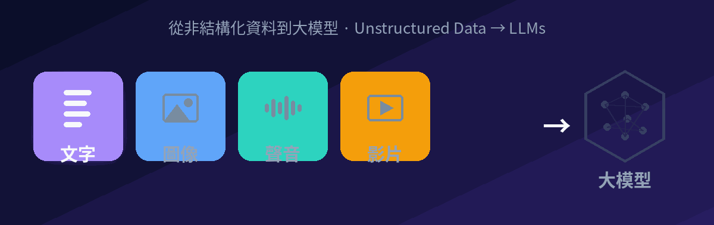
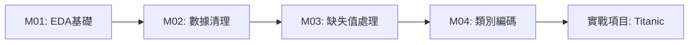
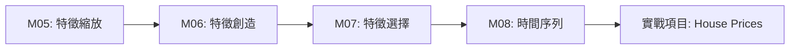

<p align="center">
  
</p>

# 🎯 資料探勘與特徵工程教學課程

[](https://python.org)
[](LICENSE)
[](README.md)

> 一套完整的資料探勘與特徵工程實戰課程，從基礎 EDA 到 **2026 大模型非結構化資料前處理**，涵蓋 11 個核心模組與 67 個實戰案例。技術棧：傳統 ML（scikit-learn）+ 現代大模型（PyTorch + HuggingFace）。

<p align="center">
  
</p>

## 📋 目錄

- [🚀 快速開始](#-快速開始)
- [📚 課程內容](#-課程內容)
- [🛠️ 環境設置](#-環境設置)
- [📊 資料集管理](#-資料集管理)
- [🎯 學習路徑](#-學習路徑)
- [💡 特色功能](#-特色功能)
- [🤝 貢獻指南](#-貢獻指南)
- [📝 許可證](#-許可證)

## 🚀 快速開始

### 1️⃣ 克隆專案
```bash
git clone https://github.com/你的用戶名/iSpan_python-FE_DM-cookbooks.git
cd iSpan_python-FE_DM-cookbooks
```

### 2️⃣ 設置環境（使用 [uv](https://docs.astral.sh/uv/)）

本專案以 **uv** 管理依賴與虛擬環境，`pyproject.toml` 為唯一依賴來源、`uv.lock` 鎖定可重現版本。

```bash
# 安裝 uv（若尚未安裝）
curl -LsSf https://astral.sh/uv/install.sh | sh   # Linux/Mac
# Windows: powershell -c "irm https://astral.sh/uv/install.ps1 | iex"

# 依 lockfile 建立虛擬環境並安裝核心依賴（自動建立 .venv）
uv sync

# 多模態前處理 (M09：文字/圖像/音訊/影片) 與下游訓練 (M11) 的 PyTorch+HuggingFace 套件
uv sync --extra multimodal --extra train
```

> 📘 **第一次用 uv？** 完整新手教學見 **[UV_GUIDE.md](UV_GUIDE.md)** —— 安裝、心智模型、指令速查、疑難排解、pip/conda 對照一次到位。
>
> 💡 不使用 uv 也可改用 pip：`pip install -r data_mining_course/environment/requirements.txt`
> （該檔由 `uv export` 自動產生，僅含核心依賴）。

### 3️⃣ 配置 Kaggle API
```bash
# 下載 kaggle.json 從 https://www.kaggle.com/account
mkdir ~/.kaggle
cp kaggle.json ~/.kaggle/
chmod 600 ~/.kaggle/kaggle.json
```

### 4️⃣ 下載資料集
```bash
uv run python data_download.py
```

### 5️⃣ 開始學習
```bash
uv run jupyter lab
```

## 📚 課程內容

### 📊 課程概覽

| 模組 | 主題 | 筆記本數 | 狀態 | 主要技術 |
|:---:|:---|:---:|:---:|:---|
| **M01** | 課程導入與EDA複習 | 3 | ✅ | Pandas, Matplotlib, Seaborn |
| **M02** | 資料清理與預處理 | 4 | ✅ | 分塊處理, 重複值, 型態轉換 |
| **M03** | 缺失值與異常值處理 | 4 | ✅ | 插補方法, 異常檢測 |
| **M04** | 類別變數編碼 | 5 | ✅ | One-Hot, Label, Target Encoding |
| **M05** | 特徵縮放與變數轉換 | 4 | ✅ | StandardScaler, 冪轉換 |
| **M06** | 特徵創造 | 4 | ✅ | 交互特徵, 聚合特徵 |
| **M07** | 特徵選擇與降維 | 5 | ✅ | 過濾法, 包裹法, PCA |
| **M08** | 時間序列特徵工程 | 5 | ✅ | 滯後特徵, 滑動窗口 |
| **M09** | 多模態特徵工程（2026 大模型前處理） | 18 | ✅ | Tokenizer, ViT/CLIP, Whisper, VideoMAE |
| **M10** | 資料探勘應用 | 9 | ✅ | 關聯規則, 聚類, 樹模型 |
| **M11** | 大模型資料前處理後：能訓練什麼模型 | 6 | ✅ | 微調, LoRA/SFT, RAG, 生成/VLM 藍圖 |

**總計**: 67 個實戰筆記本 | 12+ 個資料集 | PyTorch + HuggingFace 現代棧

### 🎯 核心學習主題

#### 🔍 **基礎數據分析**
- **探索性數據分析 (EDA)**: 統計描述、分佈視覺化、相關性分析
- **數據清理**: 重複值處理、異常值檢測、數據一致性檢查
- **數據預處理**: 型態轉換、編碼轉換、格式標準化

#### 🛠️ **特徵工程技術**
- **缺失值處理**: 簡單插補、多重插補、進階插補策略
- **類別編碼**: One-Hot、Label、Ordinal、Target Encoding
- **數值特徵**: 標準化、正規化、分箱、冪轉換
- **特徵創造**: 多項式特徵、交互特徵、聚合統計特徵

#### 🚀 **進階技術**
- **特徵選擇**: 過濾法、包裹法、嵌入法、遞歸特徵消除
- **降維技術**: PCA、t-SNE、UMAP
- **時間序列**: 滯後特徵、滑動統計、季節性分解

#### 🤖 **2026 大模型非結構化資料前處理（M09）**
- **文字**: Subword Tokenizer (BPE/WordPiece)、上下文/句嵌入、LLM 資料格式 (chat/JSONL/去重/packing)
- **圖像**: 影像張量化、ViT/CLIP 通用特徵、`transforms.v2` 增強
- **聲音**: torchaudio 16k/log-mel、Whisper/wav2vec2 特徵抽取
- **影片**: 影格抽樣、`(N,T,C,H,W)`、VideoMAE
- **多模態**: CLIP 圖文配對、VLM 資料格式
- *（經典 BoW/TF-IDF、HOG、MFCC 保留為「快速回顧」）*

#### 🚀 **下游模型訓練（M11）**
- **微調**: DistilBERT 分類、ViT/CLIP、Whisper、VideoMAE
- **大模型**: LoRA/QLoRA 高效微調、SFT 指令微調、RAG、生成式/VLM 訓練藍圖

#### 🎲 **資料探勘應用**
- **關聯規則挖掘**: Apriori 演算法、購物籃分析
- **聚類分析**: K-Means、DBSCAN、層次聚類
- **樹模型特徵重要性**: XGBoost、LightGBM、Random Forest

## 🛠️ 環境設置

### 系統需求
- **Python**: 3.9 – 3.12（由 `pyproject.toml` 的 `requires-python` 鎖定）
- **套件管理**: [uv](https://docs.astral.sh/uv/)（建議）
- **記憶體**: 8GB+ (推薦 16GB)
- **硬碟空間**: 10GB+ (含資料集)
- **Kaggle 帳號**: 用於資料集下載

### 主要依賴套件
完整清單與版本鎖定見 [`pyproject.toml`](pyproject.toml) 與 `uv.lock`。

**核心依賴**（模組 M01–M08、M10）：
```
pandas、numpy、scikit-learn、scipy、statsmodels、
matplotlib、seaborn、missingno、mlxtend、xgboost、lightgbm、
jupyterlab、notebook、kaggle
```

**選用群組**（2026 PyTorch + HuggingFace 棧）：
- `multimodal`（M09 文字/圖像/音訊/影片）：`torch、torchvision、torchaudio、transformers、datasets、tokenizers、sentence-transformers、timm、librosa、soundfile、av`
- `train`（M11 下游訓練）：`accelerate、peft、trl、evaluate`
- `classical`（經典快速回顧小節）：`spacy、scikit-image、opencv-python、nltk`
- `dev`（維護工具）：`jupytext、pdf2docx`

```bash
uv sync                                  # 僅核心依賴（M01–M08、M10）
uv sync --extra multimodal --extra train # 加裝 M09 前處理 + M11 訓練
uv sync --all-extras --dev               # 全部裝齊
```

### 🐳 Docker 支援
Docker 映像同樣以 uv 安裝依賴（見 `environment/docker/Dockerfile`）：
```bash
cd data_mining_course/environment/docker
docker compose up -d         # 開啟 http://localhost:8888
```

## 📊 資料集管理

### 🎯 智能下載系統
本專案採用 **零資料集上傳** 策略，所有資料集通過 `data_download.py` 自動下載：

```bash
python data_download.py
```

#### 互動式選單
- 📥 **下載所有資料集** (12個 Kaggle 資料集)
- 📂 **按模組下載** (選擇特定學習模組)
- 🎯 **單一資料集下載** (精確選擇)

### 📋 完整資料集清單

| 資料集 | 大小 | 用途 | 來源 |
|:---|:---:|:---|:---:|
| House Prices | ~80MB | 回歸、缺失值處理 | Kaggle Competition |
| Titanic | ~60KB | 分類、特徵工程 | Kaggle Competition |
| Insurance | ~50KB | 回歸、數值特徵 | Kaggle Dataset |
| NYC Taxi | ~1.6GB | 時空特徵、大數據 | Kaggle Competition |
| Breast Cancer | ~120KB | 分類、特徵選擇 | UCI ML Repository |
| Power Consumption | ~2.1MB | 時間序列 | UCI ML Repository |
| IMDB Reviews | ~66MB | 文字分析、NLP | Kaggle Dataset |
| Dogs vs Cats | ~800MB | 圖像分類、CNN | Kaggle Competition |
| UrbanSound8K | ~6GB | 音訊分析、頻譜 | Kaggle Dataset |
| Instacart | ~1.4GB | 關聯規則、推薦 | Kaggle Competition |
| Mall Customers | ~4KB | 聚類分析 | Kaggle Dataset |
| Telco Churn | ~950KB | 分類、商業分析 | Kaggle Dataset |

## 🎯 學習路徑

### 🎓 **初學者路徑** (2-3 週)

```mermaid
graph LR
    A[M01: EDA基礎] --> B[M02: 數據清理]
    B --> C[M03: 缺失值處理]
    C --> D[M04: 類別編碼]
    D --> E[實戰項目: Titanic]
```

### 🚀 **進階路徑** (4-6 週)

```mermaid
graph LR
    A[M05: 特徵縮放] --> B[M06: 特徵創造]
    B --> C[M07: 特徵選擇]
    C --> D[M08: 時間序列]
    D --> E[實戰項目: House Prices]
```

### 🎯 **專家路徑 / 大模型方向** (6-8 週)

```mermaid
graph LR
    A[M09: 文字/圖像/音訊/影片 前處理] --> B[資料結構設計]
    B --> C[Tokenizer / ViT / CLIP / Whisper]
    C --> D[M11: 下游微調與 LoRA/SFT]
    D --> E[生成式 / 多模態藍圖]
```

## 💡 特色功能

### 🎨 **視覺化工具**
- 互動式 EDA 儀表板
- 特徵重要性可視化
- 模型效能比較圖表
- 特徵分佈動態圖

### ⚡ **自動化工具**
- 一鍵資料集下載
- 自動特徵工程流水線
- 模型調參助手
- 實驗結果追蹤

### 📚 **學習輔助**
- 詳細註解的程式碼
- 理論與實作結合
- 常見錯誤解析
- 最佳實踐指南

## 🏗️ 專案結構

```
📁 iSpan_python-FE_DM-cookbooks/
├── 📂 data_mining_course/           # 主課程目錄
│   ├── 📂 modules/                  # 教學模組（每個案例皆為 .ipynb 筆記本）
│   │   ├── 📂 module_01_eda_intro/
│   │   ├── 📂 module_02_data_cleaning/
│   │   └── ...                      # 共 11 個模組、67 個筆記本
│   ├── 📂 datasets/                 # 資料集目錄
│   │   ├── 📂 raw/                  # 原始資料
│   │   └── 📂 processed/            # 處理後資料
│   ├── 📂 utils/                    # 工具函數
│   ├── 📂 templates/                # 範本檔案
│   └── 📂 environment/              # 環境配置 (Docker / requirements 匯出)
├── 📂 course_slides/                # 課程簡報
├── 📄 pyproject.toml                # 依賴與專案設定（uv 管理）
├── 📄 uv.lock                       # 鎖定的依賴版本
├── 📄 data_download.py              # 資料下載腳本
├── 📄 .gitignore                    # Git 忽略檔案
└── 📄 README.md                     # 專案說明
```

## 🤝 貢獻指南

我們歡迎各種形式的貢獻！

### 🎯 貢獻方式
- 🐛 **Bug 回報**: 發現問題請開 Issue
- 💡 **功能建議**: 提出新想法或改進建議
- 📝 **文檔改進**: 完善說明或添加註解
- 🔧 **程式碼貢獻**: 提交 Pull Request

### 📋 貢獻流程
1. Fork 本專案
2. 創建功能分支 (`git checkout -b feature/AmazingFeature`)
3. 提交更改 (`git commit -m 'Add some AmazingFeature'`)
4. 推送到分支 (`git push origin feature/AmazingFeature`)
5. 開啟 Pull Request

## 📞 聯絡資訊

- **課程討論**: [開啟 Issue](../../issues)
- **技術問題**: [查看 FAQ](data_mining_course/docs/faq.md)
- **課程大綱**: [查看詳細說明](data_mining_course/docs/syllabus.md)

## 📝 許可證

本專案採用 MIT 許可證。詳見 [LICENSE](LICENSE) 檔案。

---

### 🌟 如果這個專案對你有幫助，請給我們一個 Star！

[](https://github.com/你的用戶名/iSpan_python-FE_DM-cookbooks) 