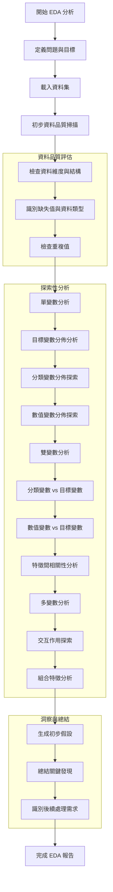

# 系統化探索性資料分析 (EDA) 工作流程指南

## 概述

本指南提供一個結構化的 EDA 分析流程，適用於各種資料科學專案。基於實戰經驗總結，幫助分析師系統性地探索未知資料集，發現關鍵洞察並生成有價值的假設。

---

## EDA 系統化工作流程



---

## 詳細步驟說明

### 階段一：問題定義與資料載入

#### 1. 定義問題與目標
- **目的**: 明確分析目標，避免漫無目的的探索
- **核心問題**: 
  - 我們要解決什麼業務問題？
  - 成功的標準是什麼？
  - 預期的輸出是什麼？

```python
# 範例：明確定義分析目標
analysis_goal = """
核心問題：影響客戶流失的關鍵因素有哪些？
目標變數：是否流失 (Churn)
分析類型：二元分類問題的探索階段
"""
```

#### 2. 載入資料集
- **操作**: 載入資料並進行基本檢查

```python
import pandas as pd
import numpy as np
import matplotlib.pyplot as plt
import seaborn as sns

# 載入資料
df = pd.read_csv('dataset.csv')
print(f"資料集維度: {df.shape}")
print(f"載入完成: {df.shape[0]} 筆記錄, {df.shape[1]} 個特徵")
```

### 階段二：資料品質評估

#### 3. 檢查資料維度與結構
```python
# 基本資料概覽
print("=== 資料基本資訊 ===")
print(f"資料維度: {df.shape}")
print(f"欄位名稱: {list(df.columns)}")
print("\n前5筆資料:")
print(df.head())
```

#### 4. 識別缺失值與資料類型
```python
# 資料品質掃描
print("=== 資料品質掃描 ===")
df.info()

print("\n=== 缺失值統計 ===")
missing_stats = df.isnull().sum()
missing_percent = (missing_stats / len(df)) * 100
missing_df = pd.DataFrame({
    '缺失數量': missing_stats,
    '缺失比例(%)': missing_percent
})
print(missing_df[missing_df['缺失數量'] > 0])
```

#### 5. 檢查重複值
```python
# 重複值檢查
duplicate_count = df.duplicated().sum()
print(f"重複記錄數量: {duplicate_count}")
if duplicate_count > 0:
    print("發現重複值，需要進一步處理")
```

### 階段三：探索性分析

#### 6. 目標變數分佈分析
```python
# 目標變數分析（以二元分類為例）
target_col = 'target_variable'  # 替換為實際目標變數名稱

plt.figure(figsize=(8, 5))
sns.countplot(data=df, x=target_col)
plt.title(f'{target_col} 分佈')
plt.show()

print(f"{target_col} 分佈比例:")
print(df[target_col].value_counts(normalize=True))
```

#### 7. 分類變數分佈探索
```python
# 識別分類變數
categorical_cols = df.select_dtypes(include=['object', 'category']).columns.tolist()

# 繪製分類變數分佈
n_cats = len(categorical_cols)
if n_cats > 0:
    fig, axes = plt.subplots(1, min(n_cats, 3), figsize=(15, 5))
    if n_cats == 1:
        axes = [axes]
    
    for i, col in enumerate(categorical_cols[:3]):
        sns.countplot(data=df, x=col, ax=axes[i])
        axes[i].set_title(f'{col} 分佈')
        axes[i].tick_params(axis='x', rotation=45)
    
    plt.tight_layout()
    plt.show()
```

#### 8. 數值變數分佈探索
```python
# 識別數值變數
numeric_cols = df.select_dtypes(include=[np.number]).columns.tolist()

# 繪製數值變數分佈
n_nums = len(numeric_cols)
if n_nums > 0:
    fig, axes = plt.subplots(1, min(n_nums, 3), figsize=(15, 5))
    if n_nums == 1:
        axes = [axes]
    
    for i, col in enumerate(numeric_cols[:3]):
        sns.histplot(data=df, x=col, kde=True, ax=axes[i])
        axes[i].set_title(f'{col} 分佈')
    
    plt.tight_layout()
    plt.show()

# 基本統計摘要
print("=== 數值變數統計摘要 ===")
print(df[numeric_cols].describe())
```

#### 9. 雙變數分析
```python
# 分類變數 vs 目標變數
for col in categorical_cols:
    if col != target_col:
        plt.figure(figsize=(10, 6))
        
        # 計算各組別的目標變數比例
        group_stats = df.groupby(col)[target_col].mean()
        
        sns.barplot(x=group_stats.index, y=group_stats.values)
        plt.title(f'{col} vs {target_col} 關係')
        plt.ylabel(f'{target_col} 平均值/比例')
        plt.xticks(rotation=45)
        plt.show()
        
        print(f"\n{col} 各組別 {target_col} 統計:")
        print(group_stats)
```

```python
# 數值變數 vs 目標變數
for col in numeric_cols:
    if col != target_col:
        plt.figure(figsize=(12, 5))
        
        # 根據目標變數分組的分佈比較
        sns.histplot(data=df, x=col, hue=target_col, kde=True, multiple="stack")
        plt.title(f'{col} vs {target_col} 關係')
        plt.show()
```

#### 10. 特徵間相關性分析
```python
# 數值特徵相關性熱力圖
if len(numeric_cols) > 1:
    plt.figure(figsize=(10, 8))
    correlation_matrix = df[numeric_cols].corr()
    sns.heatmap(correlation_matrix, annot=True, cmap='coolwarm', center=0, fmt='.2f')
    plt.title('數值特徵相關性熱力圖')
    plt.show()
    
    # 找出與目標變數相關性最高的特徵
    if target_col in numeric_cols:
        target_corr = correlation_matrix[target_col].abs().sort_values(ascending=False)
        print(f"\n與 {target_col} 相關性排序:")
        print(target_corr[1:])  # 排除自己
```

#### 11. 多變數分析
```python
# 交互作用探索（範例：兩個分類變數 vs 目標變數）
if len(categorical_cols) >= 2:
    cat1, cat2 = categorical_cols[0], categorical_cols[1]
    
    plt.figure(figsize=(10, 6))
    sns.pointplot(data=df, x=cat1, y=target_col, hue=cat2)
    plt.title(f'{cat1} 和 {cat2} 對 {target_col} 的交互影響')
    plt.xticks(rotation=45)
    plt.show()
```

### 階段四：洞察與總結

#### 12. 生成初步假設
```python
# 根據分析結果生成假設的模板
hypotheses_template = """
=== 初步假設總結 ===

主要影響因素:
1. [特徵名稱]: [影響描述]
2. [特徵名稱]: [影響描述]

次要影響因素:
1. [特徵名稱]: [影響描述]

交互作用:
1. [特徵組合]: [交互影響描述]

需要進一步驗證的假設:
1. [假設描述]
2. [假設描述]
"""

print(hypotheses_template)
```

#### 13. 識別後續處理需求
```python
# 資料品質問題總結
data_quality_issues = {
    '缺失值處理': [],
    '異常值處理': [],
    '特徵工程': [],
    '資料轉換': []
}

# 根據分析結果填充
print("=== 後續處理需求 ===")
for category, issues in data_quality_issues.items():
    print(f"{category}: {issues if issues else '無明顯問題'}")
```

---

## 常見陷阱與注意事項

### 1. 資料品質陷阱
- **缺失值誤解**: 不要假設缺失是隨機的
- **異常值忽視**: 極端值可能包含重要資訊
- **資料洩漏**: 注意未來資訊洩漏到特徵中

### 2. 分析陷阱
- **相關性≠因果性**: 避免因果關係的錯誤推論
- **過度解釋**: 避免從有限樣本得出過於廣泛的結論
- **選擇性偏見**: 只關注支持預期假設的證據

### 3. 視覺化陷阱
- **Y軸截斷**: 條形圖必須從0開始
- **誤導性配色**: 使用中性、一致的配色方案
- **缺乏上下文**: 確保圖表有清晰的標題和標籤

---

## 檢查清單 (Checklist)

在完成 EDA 之前，確保已經：

- [ ] 明確定義了分析目標和成功標準
- [ ] 充分了解資料的來源和背景
- [ ] 識別並量化了所有資料品質問題
- [ ] 探索了目標變數的分佈特性
- [ ] 分析了所有重要特徵與目標變數的關係
- [ ] 檢查了特徵間的相關性和多重共線性
- [ ] 探索了可能的交互作用
- [ ] 生成了基於證據的假設
- [ ] 記錄了所有重要發現和異常
- [ ] 規劃了下一步的資料處理和建模策略

---

## 範本使用指南

1. **複製此流程**: 為每個新專案建立對應的 EDA 筆記本
2. **調整步驟**: 根據資料特性和業務需求調整分析深度
3. **記錄發現**: 在每個步驟中詳細記錄觀察和發現
4. **迭代改進**: EDA 是迭代過程，根據新發現回頭調整分析
5. **團隊協作**: 與領域專家討論發現，驗證假設的合理性

這個系統化流程確保了全面、一致且可重複的資料探索，為後續的特徵工程和建模奠定堅實基礎。 