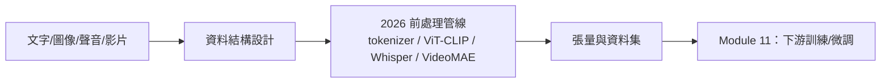

# 模組九講義：多模態特徵工程——非結構化資料的 2026 大模型前處理

> 把**文字、圖像、聲音、影片**正確轉成大模型可訓練的**張量與資料集格式**。
> 技術棧：**PyTorch + HuggingFace**（`transformers`/`datasets`/`tokenizers`/`torchvision`/`torchaudio`/`timm`）。
> 全模組使用**真實資料集**示範（非合成 mock）。

---

## 1. 導論：資料結構設計是一切的起點

### 1.1 第一原理

> **「資料的形狀與格式，決定了你能接哪一類模型。」**
> 因此每個模態小節都先講清楚「**輸入/輸出的張量 shape、標籤格式、儲存格式**」，再進前處理管線。

### 1.2 各模態的標準資料結構

| 模態 | 模型輸入張量 | 標籤（範例） |
|:--|:--|:--|
| 文字 | `input_ids (B, L)` + `attention_mask (B, L)` | 類別 `(B,)` / 生成目標 / 文字 |
| 圖像 | `(N, C, H, W)`（PyTorch channels-first） | 類別 / 多標籤 / bbox / mask |
| 聲音 | log-mel `(N, n_mels, T)` 或波形 `(N, samples)` | 類別 / ASR 文字 |
| 影片 | `(N, T, C, H, W)`（比圖像多時間維 T） | 動作類別 / 時序片段 / 字幕 |

### 1.3 經典技術的定位（快速帶過）

BoW/TF-IDF、Color Histogram/HOG、MFCC 是 2013–2018 的主流手工特徵，今天仍是理解基礎，
但**已非大模型訓練的主流**。各模態保留一節「**經典快速回顧**」點出限制，主體放在 2026 現代管線。

---

## 2. 文本特徵工程 (Text)

### 2.1 經典快速回顧：BoW / TF-IDF / 靜態詞向量

- **BoW / TF-IDF**：把文件變成稀疏 `(N_docs, V)` 向量；至今仍是**強力的傳統分類基線**，但**上下文無關**。
- **靜態詞向量（Word2Vec/GloVe/spaCy）**：稠密向量，但「一詞一向量」無法處理多義（如 *bank* = 銀行/河岸）。

### 2.2 ⭐ Subword Tokenization（現代起點）

- **為何 subword**：解決 OOV、控制詞彙表、跨語言。三大演算法：**BPE**（GPT/Llama）、**WordPiece**（BERT）、**Unigram/SentencePiece**（T5/多語）。
- **標準輸出**：`AutoTokenizer` → `input_ids (B,L)` + `attention_mask (B,L)`；`padding`/`truncation` 產生規整張量。
- **Token 預算**：token ≠ 單字（中文常 1 字 ≈ 1–2 token），估算資料量/成本要用 token 數。

### 2.3 ⭐ 上下文嵌入與句向量

- **上下文嵌入**：把 `input_ids` 餵進 Transformer（BERT 系），得到**隨上下文變化**的 `last_hidden_state (B,L,D)`，徹底解決一詞多義。
- **句向量**：CLS / mean pooling → `(B,D)`；句向量任務優先用 `sentence-transformers`。
- **語意檢索**：向量化 + 餘弦相似度 top-k，是 **RAG 檢索**的本質。

### 2.4 ⭐ LLM 訓練資料格式

| 階段 | 資料格式 | 重點 |
|:--|:--|:--|
| 預訓練 | `{"text": ...}` + **packing** | 去重、品質/語言過濾、去污染 |
| SFT 指令微調 | `messages`（chat）/ instruction JSONL | **chat template** 攤平成 input_ids |
| 偏好對齊 | `{prompt, chosen, rejected}` | 配對品質 |

> **資料品質 > 資料數量**，是 2026 LLM 資料工程的共識。

---

## 3. 圖像特徵工程 (Image)

### 3.1 經典快速回顧：Color Histogram / HOG

- 色彩直方圖：固定長度、丟失空間資訊；HOG：捕捉邊緣形狀。兩者皆**無語意、對視角/光照敏感**。

### 3.2 ⭐ 影像 → 張量前處理

- 四步：**decode → resize/crop → to-tensor → normalize**（用與預訓練一致的 mean/std）。
- 排列慣例：PyTorch `(N,C,H,W)` channels-first vs TF/numpy `(N,H,W,C)` channels-last。
- `torchvision.transforms.v2` 與 `AutoImageProcessor`（跟著模型走的前處理）。

### 3.3 ⭐ 現代影像表示：ViT 與 CLIP

- **ViT**：把影像切成 patch 當「視覺 token」，丟進 Transformer；用 `timm` 一行載入預訓練 ViT 抽特徵（取代舊的 VGG16/Keras）。
- **CLIP**：圖文對齊嵌入，可做 **zero-shot 分類**（改類別只要改文字 prompt）。

### 3.4 資料增強與資料集組織

- 訓練用隨機增強（RandomResizedCrop/Flip/ColorJitter），驗證用確定性前處理。
- 規模選擇：**ImageFolder**（小）→ **HF `datasets`**（中大）→ **WebDataset/Parquet**（超大）。

---

## 4. 音訊特徵工程 (Audio)

### 4.1 經典快速回顧：MFCC / 手工頻譜特徵

- MFCC、譜質心/滾降/過零率：可聚合成固定長度特徵餵傳統分類器，但**無語意**。

### 4.2 ⭐ 波形 → 張量前處理

- 三步：**重採樣 16kHz → 單聲道 → 振幅正規化**（torchaudio）。
- **log-mel 頻譜** `(N, n_mels≈80, T)` 是多數神經音訊模型的實際輸入。

### 4.3 ⭐ 現代音訊表示：Whisper / wav2vec2

- `AutoFeatureExtractor` 自動產出模型輸入：**Whisper** 吃 log-mel `input_features (B,80,3000)`；**wav2vec2/HuBERT** 吃正規化波形 `input_values (B,samples)`。
- 取 `last_hidden_state` 時間池化 → 音訊嵌入 `(B,D)`，供分類/檢索。

---

## 5. 影片特徵工程 (Video)

- **影片 = 影格序列**，比圖像多一個時間維；模型輸入 `(N, T, C, H, W)`。
- **解碼**：PyAV (`av`) / `torchvision.io`。**影格抽樣**：均勻（涵蓋全片）/ 密集（聚焦局部）/ 分段 TSN（訓練增強）。
- **VideoMAE / ViViT**：以時空注意力做 clip-level 動作辨識；`AutoImageProcessor` 標準化成 `(N,T,C,H,W)`。

---

## 6. 多模態融合 (Multimodal)

- **圖文配對（CLIP）**：`{image, text}`，把圖與文嵌到同一空間，支援跨模態檢索與 zero-shot。
- **VLM（視覺語言模型）**：影像 → 視覺 token，與文字 token 串接後進 LLM；資料是「**帶圖對話**」messages（LLaVA、Qwen-VL）。
- 融合策略：早期融合（特徵拼接）/ 晚期融合（決策層）/ 混合融合。

---

## 7. 總結與銜接

本模組把四種非結構化資料前處理成大模型可訓練的格式。**Module 11** 接著回答：
這些資料整理好之後，**能訓練/微調什麼模型**（分類微調、LLM LoRA/SFT、RAG、ViT/CLIP、
Whisper、VideoMAE、以及生成式/多模態藍圖）。
