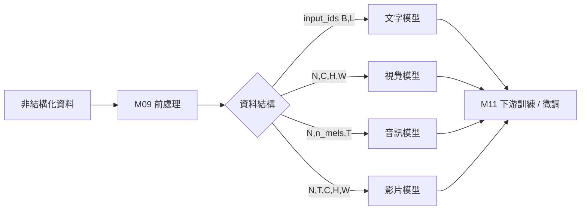
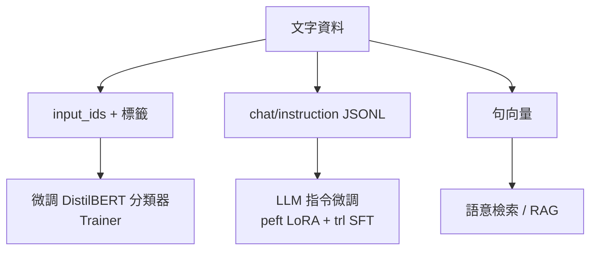
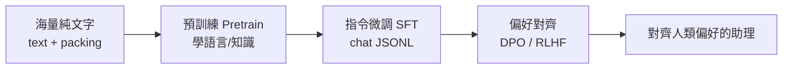

# 模組十一講義：大模型資料前處理後——能訓練什麼模型？

> 銜接 Module 9（把文字／圖像／聲音／影片變成張量與資料集）之後，本模組回答：
> **「資料整理好之後，可以訓練／微調什麼模型、做什麼任務？」**
> 定位：**概念藍圖 + CPU 友善的最小 demo**（全部使用真實資料）。

---

## 1. 導論：從資料到模型的地圖

### 1.1 核心觀念

> **資料的形狀與格式，決定了你能接哪一類模型。** 這是貫穿 M09→M11 的主軸。

### 1.2 資料結構 → 模型 → 任務 對照表

| 模態 | 前處理後的資料結構 | 可訓練/微調的模型 | 典型任務 |
|:--|:--|:--|:--|
| 文字 | `input_ids (B,L)` | BERT / DistilBERT | 文本分類、NER |
| 文字 | chat/instruction JSONL | LLM（Llama/Qwen）+ LoRA | 對話、指令遵循 |
| 文字 | 句向量 `(N,D)` | 句向量模型 / 檢索器 | 語意檢索、RAG |
| 圖像 | `(N,C,H,W)` | ViT / CLIP | 影像分類、跨模態檢索 |
| 聲音 | log-mel `(N,80,T)` / 波形 | Whisper / wav2vec2 | 語音辨識、音訊分類 |
| 影片 | `(N,T,C,H,W)` | VideoMAE / ViViT | 動作辨識 |
| 圖+文 | VLM messages | VLM（LLaVA/Qwen-VL） | 看圖問答 |

---

## 2. 三種訓練範式與參數高效微調

### 2.1 三種範式

| 範式 | 更新哪些參數 | 算力/資料 | 何時用 |
|:--|:--|:--|:--|
| 從零預訓練 | 全部（隨機起始） | 極高 | 幾乎不自己做 |
| 全參數微調 | 全部（從預訓練起始） | 高 | 資料多、要極致效果 |
| **參數高效微調 (LoRA/QLoRA)** | 只加一小撮新參數 | **低（單卡可跑）** | **2026 最常見** |

### 2.2 LoRA 直覺

凍結原模型，只在每層插入兩個低秩矩陣去學「差異」，可訓練參數常 **< 1%**，
卻能逼近全參數微調效果——這讓「用自己的資料微調大模型」變得人人可及。
**QLoRA** 再加上 4-bit 量化，單張消費級 GPU 即可微調 7B 模型。

### 2.3 2026 技術棧

`torch` · `transformers`（含 `Trainer`）· `datasets` · `peft`（LoRA/QLoRA）·
`trl`（SFT/DPO）· `accelerate` · `evaluate`

---

## 3. 文字下游：分類微調 / LLM 微調 / RAG

### 3.1 三條主路線

| 路線 | 資料格式 | 模型 | 技術 |
|:--|:--|:--|:--|
| 分類微調 | `input_ids (B,L)` + 標籤 | DistilBERT | `Trainer` |
| 指令微調 | chat/instruction JSONL | LLM | `peft` LoRA + `trl` SFT |
| RAG | 句向量 + 知識庫 | 檢索器 + LLM | 語意檢索 |

### 3.2 RAG（檢索增強生成）

RAG = **檢索**（用句向量找到相關文件）+ **生成**（把找到的內容塞進 LLM prompt）。
讓 LLM 的回答「有依據」，是 2026 企業落地最常見的應用模式。

---

## 4. 影像 / 音訊 / 影片下游

| 模態 | 免訓練選項 | 微調選項 | 資料 |
|:--|:--|:--|:--|
| 影像 | CLIP zero-shot（改 prompt 即換類別） | 微調 ViT 分類器 | `(N,C,H,W)` + 標籤 |
| 音訊 | Whisper 直接推論 ASR | 微調 Whisper / wav2vec2 | log-mel / 波形 + 標籤 |
| 影片 | VideoMAE（Kinetics 預訓練）推論 | 微調 VideoMAE | `(N,T,C,H,W)` + 動作標籤 |

> **實務策略**：常先用 zero-shot / 預訓練模型快速起步（如 CLIP、Whisper、VideoMAE），
> 累積標註後再微調提升表現。四種模態的微調多半共用同一套 `Trainer` / `peft` 流程，
> 差別只在模型與前處理器。

---

## 5. 生成式與多模態大模型訓練藍圖

### 5.1 LLM 三階段訓練管線

| 階段 | 資料格式 | 目標 | 工具 |
|:--|:--|:--|:--|
| 預訓練 | `{"text": ...}` + packing | 學語言與世界知識 | transformers |
| SFT | chat/instruction JSONL | 學會遵循指令 | `trl` SFTTrainer + `peft` |
| 偏好對齊 | `{prompt, chosen, rejected}` | 對齊人類偏好 | `trl` DPOTrainer |

> **資料品質 > 資料數量**：去重、品質過濾、去污染（M09 文字 04）決定模型上限。

### 5.2 文生圖 Diffusion 與多模態 VLM

- **Diffusion（文生圖）**：資料是**圖文配對** `{image, caption}`；影像 → VAE latent，
  caption → text encoder；訓練目標是「以文字為條件，從加噪 latent 還原原圖」。微調用 LoRA / DreamBooth。
- **VLM（視覺語言模型）**：影像 → 視覺編碼器(ViT/CLIP) → 投影層 → 視覺 token，
  與文字 token 串接後一起進 LLM。資料是「帶圖對話」messages。代表：LLaVA、Qwen-VL。

---

## 6. 總結：資料前處理 → 大模型

| 模態 | M09 學到的前處理 | M11 能訓練的模型 |
|:--|:--|:--|
| 文字 | tokenizer、嵌入、LLM 資料格式 | 分類器、LLM(LoRA/SFT)、RAG |
| 圖像 | 張量化、ViT/CLIP、增強 | ViT 分類、CLIP、Diffusion |
| 聲音 | 16k/log-mel、特徵抽取 | Whisper ASR、wav2vec2 分類 |
| 影片 | 抽樣、`(N,T,C,H,W)` | VideoMAE 動作辨識 |
| 多模態 | 圖文配對、VLM 格式 | CLIP、VLM |

**核心結論**：把資料整理對了，2026 的大模型訓練/微調，大多是
「**換模型、套同一套 Trainer/PEFT 流程**」。一切的起點，是 **資料結構設計**。
